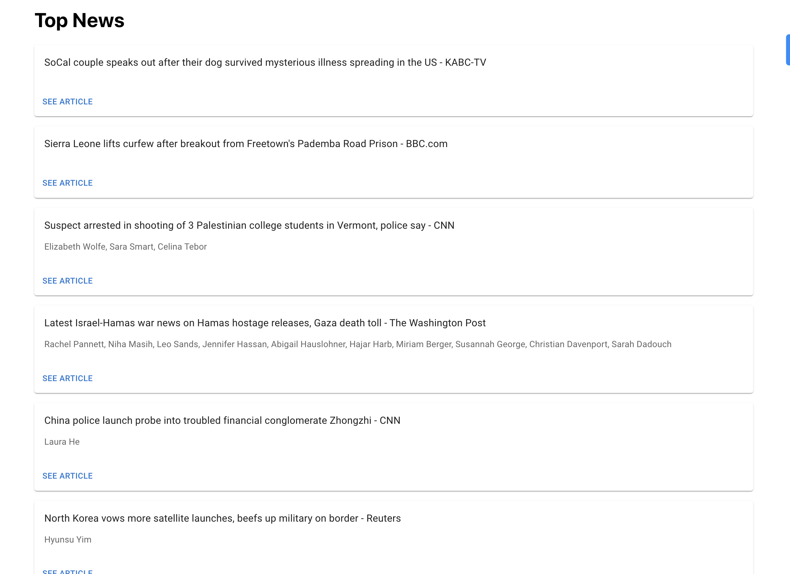
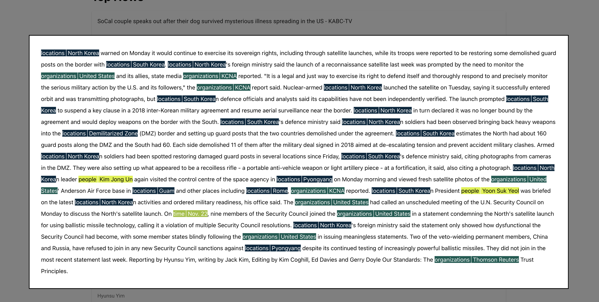
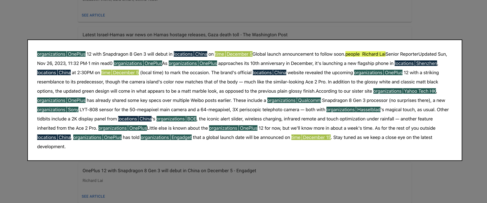

## Overview

**Basic organization**

```
/news-takehome-api
  /models - shared models
  /logic - the bulk of the business logic for this
  /routes - where each endpoint/resource is defined
  /utils
  /vendors - API facades eg. wrappers for OpenAI and News API
/news-takehom-ui
  /src
    /api - API facade for BE
    /pages - top level components, if I had set up a Router, these would be the components attached to the router
    /components -small reusable components
    /constants
```

**High-level approach**

There are two endpoints:

```
GET /v1/news/top

POST /v1/news/content
{
  url
}
```

`/v1/news/top` powers the front listing page. This content is directly taken from the News API Top endpoint

`/v1/news/content` powers the named entity analysis page. At a high-level this is what it does:

- fetch the raw HTML of a News API page (the content provided by News API is truncated)
- use `cheerio` to grab the content within a `<article>` HTML tag (this is to reduce what we're sending over to an LLM)
- we do an LLM call to extract the content out of the HTML
- we do another LLM call to do named entity recognition against the content extracted from HTML
- we serialize both the content and the named entities in a format more consumable by the Frontend to be rendered
  - see `news-takehome-api/logic/content-serialization/contentAndEntitySerializer.test.js` for more details

## Setup

### Running the API

```
cd ./news-takehome-api
```

Fill out `.env-template` and renamed to `.env`

Install deps with `yarn`

Run in dev mode with `yarn dev`

### Running the FE

```
cd ./news-takehome-ui
```

Install deps with `yarn`

Run in dev mode with `yarn start`

Note: If you're running the BE on anything other than port 3001, you may need to update the `proxy` field in the FE `package.json`

## Testing

I didn't get around to implementing tests, but there is a unit test at `news-takehome-api/logic/content-serialization/contentAndEntitySerializer.test.js` since this was pretty logic heavy

## Known Bugs

Sometimes we aren't able to directly fetch HTML from the News article url and this sometimes crashes the BE

We can potentially be filling the context window, I didn't have a chance to implement document chunking

This whole thing is slow AF, I'd definitely precompute this with persistence on the BE with more time

## Problems I encounterd

Figuring out how to get the content and entities into a format that worked well for rendering took longer than expected. Tbh, tried to see if ChatGPT could generate the algorithm in one go, but I ended up having to implement it by hand
